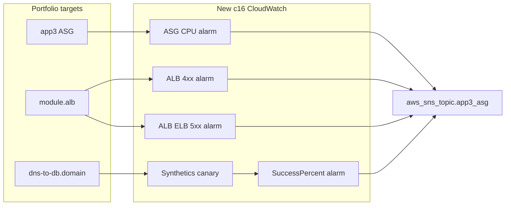

# CloudWatch alarms/synthetics for portfolio-DNS-to-DB-ASG

## Verdict

From [17-AWS-CloudWatch](../17-AWS-CloudWatch/terraform-manifests), these map cleanly onto the portfolio stack. This folder is the **new sibling project** so the original [portfolio-DNS-to-DB-ASG](../portfolio-DNS-to-DB-ASG) stays untouched.

| Lesson 17 piece | Fits portfolio? | Why |
|---|---|---|
| ALB HTTP 4xx alarm (`c14-03`) | Yes | Portfolio already has `module.alb` and `module.alb.arn_suffix` ([c10-03](../portfolio-DNS-to-DB-ASG/terraform-manifests/c10-03-ALB-application-loadbalancer-outputs.tf)) |
| Synthetics canary + `SuccessPercent` alarm (`c14-05`) | Yes | Public HTTPS DNS `dns-to-db.<domain>` ([c12](../portfolio-DNS-to-DB-ASG/terraform-manifests/c12-route53-dnsregistration.tf)); canary URL should target your domain (not `stacksimplify.com`) |
| ASG CPU metric alarm (`c14-02`) | Yes, **adapted** | Portfolio has `aws_autoscaling_group.app3` and SNS `aws_sns_topic.app3_asg` |
| Step scaling policy in `c14-02` (`high_cpu`) | **Skip** | Portfolio already scales via target tracking CPU + ALB request count ([c15-05](../portfolio-DNS-to-DB-ASG/terraform-manifests/c15-05-app3-asg-ttsp.tf)). Adding step scaling would fight TTSP |
| CIS alarms module (`c14-04`) | **Skip for v1** | Creates filters on an empty log group only; no CloudTrail → CW Logs wiring in lesson 17. Weak for a portfolio story and not tied to the app stack |

**Default scope for this project:** ALB Target 4xx + ELB 5xx alarms, App3 ASG CPU **notify-only** alarm, Synthetics canary (your DNS URL) + SuccessPercent alarm. Wire all `alarm_actions` / `ok_actions` to existing `aws_sns_topic.app3_asg`.

## What the portfolio already has (monitoring hooks)

- **ASG:** `aws_autoscaling_group.app3` + TTSP (CPU + `ALBRequestCountPerTarget` on `mytg3`)
- **ALB:** path routing `/app1*`, `/app2*`, `/*` → TGs `mytg1` / `mytg2` / `mytg3`
- **SNS:** `aws_sns_topic.app3_asg` (ASG lifecycle email today; reuse for alarms)
- **DNS/TLS:** Route 53 + ACM → `https://dns-to-db.<your-domain>`
- **RDS:** present in portfolio but **not** covered by lesson 17 (optional later)
- **No** CloudWatch alarms/synthetics yet; `c14-*` is already used for SSM/IAM

## New folder layout

This project: **`portfolio-DNS-to-DB-ASG-CloudWatch`**.

Next implementation step: copy manifests from [portfolio-DNS-to-DB-ASG](../portfolio-DNS-to-DB-ASG), then add CloudWatch as **`c16-*`** (portfolio already owns `c14` SSM and `c15` ASG). Do **not** edit the original portfolio.

Suggested new files (adapted from lesson 17):

- `c16-01-cloudwatch-variables.tf` — canary URL / thresholds if you want them variable
- `c16-02-cloudwatch-asg-alarms.tf` — CPUUtilization ≥ 80% on `aws_autoscaling_group.app3`, SNS only (no step policy)
- `c16-03-cloudwatch-alb-alarms.tf` — `HTTPCode_Target_4XX_Count` + `HTTPCode_ELB_5XX_Count` on `module.alb.arn_suffix`
- `c16-04-cloudwatch-synthetics.tf` — IAM role/policy, S3 artifacts bucket, `aws_synthetics_canary`, SuccessPercent alarm
- Canary zip/source under `terraform-manifests/` with URL set to `https://dns-to-db.<your-domain>/` (optionally also `/app1/`, `/app2/` in a follow-up)

Resource renames when porting from 17:

| Lesson 17 | Portfolio copy |
|---|---|
| `aws_autoscaling_group.my_asg` | `aws_autoscaling_group.app3` |
| `aws_sns_topic.myasg_sns_topic` | `aws_sns_topic.app3_asg` |
| Canary URL `https://stacksimplify.com` | Your Route 53 hostname |
| Fixed IAM role/policy/bucket names | Prefix with `local.name` / `random_pet.this.id` to avoid account collisions |

## Adaptations (important)

1. **ASG alarm:** keep the metric alarm; drop `aws_autoscaling_policy.high_cpu` and remove it from `alarm_actions`.
2. **Synthetics cost:** lesson uses `rate(1 minute)` — fine for a short demo; destroy when idle (same cost discipline as the portfolio README).
3. **IAM for canary:** lesson uses `managed_policy_arns` on the role; prefer `aws_iam_role_policy_attachment` for newer AWS provider compatibility.
4. **CIS:** leave out of v1 unless you later add CloudTrail → the same log group.

## Optional extras (not in 17, but natural on this stack)

Only if you want to go beyond the course later: RDS CPU/storage/connections; per-TG `UnHealthyHostCount` / `HTTPCode_Target_5XX_Count` / `TargetResponseTime` for `mytg1`–`mytg3`.

## Implementation todos

Tracked in the YAML frontmatter above (`todos`). Ask an agent to run one or more by id, for example: “do `copy-manifests`” or “implement all pending todos in PLAN.md”.
