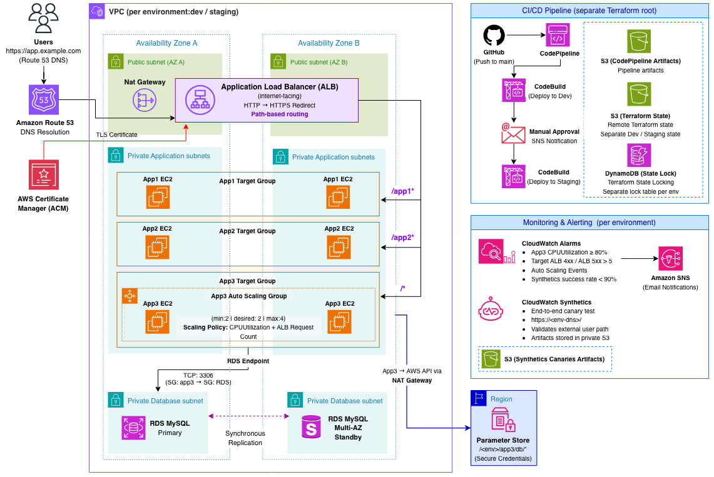

# Multi-Environment AWS Cloud Architecture with Terraform & CI/CD

A highly available, multi-environment AWS architecture designed and implemented with Terraform, demonstrating scalable application delivery, secure private networking, database high availability, automated environment promotion, and end-to-end observability.




## Solution Overview

This project demonstrates the design and implementation of a reusable AWS application platform across **development and staging environments**.

The architecture distributes application workloads across two Availability Zones behind an internet-facing Application Load Balancer. Path-based routing directs traffic to three application workloads, while App3 adds dynamic scaling through an Auto Scaling Group and connects to a private Multi-AZ RDS MySQL database.

Application and database resources remain in private subnets. Database access is restricted to App3 through security-group-to-security-group rules, and application credentials are retrieved securely from AWS Systems Manager Parameter Store.

Infrastructure is managed through Terraform and promoted through an automated CI/CD workflow from development to staging with a manual approval gate. CloudWatch alarms, CloudWatch Synthetics, and SNS notifications provide infrastructure and end-to-end application visibility.

Each environment is independently deployed with its own VPC, DNS hostname, Terraform state, and monitoring resources.

---


## Architecture Highlights

- **Multi-AZ application architecture** — application workloads are distributed across two Availability Zones behind an Application Load Balancer.
- **Path-based application delivery** — `/app1`*, `/app2*`, and `/*` route to dedicated target groups for App1, App2, and App3.
- **Elastic compute** — App3 runs in a multi-AZ Auto Scaling Group using CPU utilization and ALB request count for target tracking.
- **RDS high availability** — App3 connects to a private Multi-AZ RDS MySQL deployment through the RDS endpoint.
- **Network segmentation** — public, private application, and dedicated database subnets separate internet-facing and internal resources.
- **Secure configuration and administration** — Parameter Store SecureString values, scoped IAM permissions, and Systems Manager Session Manager remove the need for inbound SSH, bastion hosts, and EC2 key pairs.
- **Infrastructure as Code** — Terraform defines the application infrastructure and CI/CD platform using separate Terraform roots.
- **Environment isolation** — development and staging use separate VPCs, DNS names, Terraform state, and state-locking tables.
- **Automated environment promotion** — GitHub → CodePipeline → Development → Manual Approval → Staging.
- **Operational visibility** — CloudWatch alarms, CloudWatch Synthetics, and SNS notifications monitor infrastructure health and the external application path.

---


## Architecture Walkthrough


### Networking

Each environment deploys a custom VPC (`10.0.0.0/16`) across two Availability Zones in `us-east-1`.


| Subnet Type         | Resources                              |
| ------------------- | -------------------------------------- |
| Public              | Application Load Balancer, NAT Gateway |
| Private Application | App1, App2, App3                       |
| Private Database    | RDS subnet group                       |


Application instances do not have public IP addresses.

User traffic enters the environment only through the internet-facing Application Load Balancer. Private application resources use the NAT Gateway for required outbound access, including AWS API access.

### DNS, TLS, and Load Balancing

Each environment has a Route 53 hostname that resolves to the Application Load Balancer through an alias A record.

AWS Certificate Manager provides the TLS certificate, with DNS-based certificate validation. The ALB accepts HTTPS traffic on port 443 and redirects HTTP requests on port 80 to HTTPS.

The HTTPS listener uses path-based routing:


| Request Path | Target Group | Workload                  |
| ------------ | ------------ | ------------------------- |
| `/app1*`     | App1         | Two private EC2 instances |
| `/app2*`     | App2         | Two private EC2 instances |
| `/*`         | App3         | Auto Scaling Group        |


App1 and App2 each run on two private EC2 instances distributed across the two Availability Zones.

Health checks use HTTP against each application's path. App3 uses ELB health checks so unhealthy instances can be removed from service and replaced by the Auto Scaling Group.

---


## App3 Auto Scaling

App3 demonstrates an elastic application tier managed by a single Auto Scaling Group spanning both private application subnets.


| Setting                 | Configuration            |
| ----------------------- | ------------------------ |
| Minimum capacity        | 2                        |
| Desired capacity        | 2                        |
| Maximum capacity        | 4                        |
| CPU target tracking     | 50% ASG CPU              |
| ALB target tracking     | 10 requests per target   |
| Launch template updates | Rolling instance refresh |


The desired capacity of two allows App3 instances to be distributed across the two enabled Availability Zones while the ASG can scale to a maximum of four instances.

Two target-tracking policies control scaling:

- Average ASG CPU utilization
- ALB requests per target

A separate CloudWatch alarm sends an SNS notification when App3 CPU utilization reaches 80% or higher.

The alarm is intentionally **notify-only** rather than connected to a second step-scaling policy. This avoids having target tracking and alarm-driven step scaling issue competing capacity changes to the same Auto Scaling Group.

---


## App3 and the Data Tier

App3 connects to **Amazon RDS for MySQL 8.0** running in dedicated private database subnets.

The database uses a Multi-AZ deployment and is not publicly accessible.

Database access is restricted at the network layer:

```text
App3 Security Group
        |
        | TCP 3306
        v
RDS Security Group
```

The RDS security group accepts MySQL traffic only from the App3 security group rather than from a CIDR range.

This means App1 and App2 cannot directly access the database.

### Database Credentials

At boot, App3 retrieves database connection information from AWS Systems Manager Parameter Store:

```text
/<environment>/app3/db/username
/<environment>/app3/db/password
/<environment>/app3/db/name
/<environment>/app3/db/port
```

The password is stored as a `SecureString`.

The App3 instance role can read only its environment-specific:

```text
/<environment>/app3/db/*
```

path.

App3 connects to MySQL using the application user `app3` rather than the RDS master user `dbadmin`.

Terraform does not create the application-level MySQL user. After the initial infrastructure deployment, CodeBuild runs:

```text
ops/phase-a-create-app3-user.sh
```

and refreshes the Auto Scaling Group so replacement instances receive a working application login.

Pipeline-time passwords are stored in Parameter Store:

```text
/CodeBuild/DB_PASSWORD
/CodeBuild/APP3_DB_PASSWORD
```

Terraform copies the required App3 credentials into the environment-specific application path during deployment.

Sensitive values are not committed to Git. `secrets.tfvars` is gitignored and generated during the build.

---


## Security Design

Security controls implemented in the architecture include:

- Application workloads run in private subnets.
- RDS runs in dedicated private database subnets.
- Only the Application Load Balancer is internet-facing.
- RDS is not publicly accessible.
- MySQL access is restricted from the App3 security group to the RDS security group on TCP 3306.
- App3 IAM permissions allow access only to its environment-specific database parameter path.
- App3 cannot retrieve the RDS master password.
- Database passwords are stored using Parameter Store `SecureString`.
- TLS certificates are managed through AWS Certificate Manager.
- HTTP traffic is redirected to HTTPS.
- EC2 administration uses AWS Systems Manager Session Manager rather than SSH keys or bastion hosts.
- `secrets.tfvars` and `pipeline/terraform.tfvars` are gitignored.
- Synthetics artifact buckets block public access.
- Application Terraform state is stored remotely rather than committed to Git.

No AWS credentials or application secrets should be committed to this repository.

---


## CI/CD Architecture

The delivery pipeline is defined separately from the application infrastructure under:

```text
pipeline/
```

This Terraform root is bootstrapped once from a local workstation.

CodeBuild does **not** apply the `pipeline/` Terraform configuration. It deploys only:

```text
terraform-manifests/
```

This separation prevents a Git push from modifying the pipeline that is currently executing the application deployment.

### Deployment Flow

```text
GitHub (main)
      |
      v
AWS CodePipeline
      |
      v
CodeBuild — Development
      |
      v
Manual Approval
      |
      v
CodeBuild — Staging
```

The manual approval action publishes through SNS so the staging deployment requires an explicit promotion decision.

CodePipeline V2 runs in `QUEUED` mode. If another commit arrives while Terraform is still applying infrastructure, the new execution waits instead of cancelling the deployment already in progress.

This is useful because resources such as ACM certificates, Multi-AZ RDS, and Auto Scaling bootstrap operations can result in longer infrastructure deployments.

The CodeBuild timeout is configured for 90 minutes.

### Build Workflow

Each environment build:

1. Installs Terraform 1.15.8.
2. Creates `secrets.tfvars` from Parameter Store values.
3. Runs `terraform init`.
4. Runs `terraform validate`.
5. Runs `terraform plan`.
6. Executes `$TF_COMMAND` using the environment-specific backend and variable files.

Development uses:

```text
dev.conf
dev.tfvars
```

Staging uses:

```text
stag.conf
stag.tfvars
```

Terraform authenticates through the CodeBuild service role rather than long-lived AWS access keys.

---


## Terraform State Management

Application infrastructure state is stored remotely in Amazon S3.

Development and staging use separate state:

```text
S3: dnstodb-cw-codepipeline-tfstate

├── dnstodb-cw/dev/terraform.tfstate
│   └── DynamoDB lock: dnstodb-cw-dev-tfstate
│
└── dnstodb-cw/stag/terraform.tfstate
    └── DynamoDB lock: dnstodb-cw-stag-tfstate
```

DynamoDB provides state locking so concurrent Terraform executions cannot modify the same environment state simultaneously.

Separating environment state reduces the blast radius of infrastructure changes and prevents a staging deployment from modifying development state.

The `pipeline/` Terraform root uses local state because it provisions the application state bucket and DynamoDB lock tables.

---


## Monitoring and Observability

CloudWatch, CloudWatch Synthetics, and SNS provide infrastructure and application monitoring.


| Signal                            | Behavior         |
| --------------------------------- | ---------------- |
| App3 ASG CPU ≥ 80%                | SNS notification |
| ALB target 4xx / ELB 5xx          | SNS notification |
| Synthetics `SuccessPercent < 90%` | SNS notification |
| ASG launch / terminate / errors   | SNS notification |


### End-to-End Monitoring

CloudWatch Synthetics canaries:

```text
dev-dnstodb
stag-dnstodb
```

call each environment's HTTPS endpoint every minute:

```text
https://<environment-dns>/
```

Because the canary executes from outside the VPC, it validates the external user-facing request path:

```text
DNS
 ↓
TLS / ACM
 ↓
Application Load Balancer
 ↓
App3
```

This can detect failures that infrastructure-only metrics may not reveal, including DNS, certificate, load-balancing, or application availability problems.

Canary artifacts are stored in a private S3 bucket with public access blocked.

---


## Key Architecture Decisions

This project focuses not only on provisioning AWS resources, but on the architectural decisions behind how those resources interact.


| Design Decision                         | Rationale                                                                                            |
| --------------------------------------- | ---------------------------------------------------------------------------------------------------- |
| Public vs. private subnet separation    | Users reach the ALB while application and database resources remain privately addressed              |
| Multi-AZ application deployment         | Distributes workloads across Availability Zones to improve application availability                  |
| Multi-AZ RDS                            | Provides database high availability through a standby in another Availability Zone                   |
| SG-to-SG database access                | Authorizes App3 based on security-group membership instead of a brittle CIDR range                   |
| App3 Auto Scaling target tracking       | Allows compute capacity to respond to application demand                                             |
| Notify-only CPU alarm                   | Provides operational visibility without introducing a competing scaling controller                   |
| Session Manager instead of SSH          | Provides administrative access without inbound SSH, bastion hosts, or EC2 key pairs                  |
| App3 database user instead of `dbadmin` | Applies least privilege at the database layer                                                        |
| Parameter Store SecureString            | Keeps database credentials outside source control and application code                               |
| Separate Terraform roots                | Prevents application deployments from modifying the CI/CD infrastructure executing them              |
| Separate state per environment          | Isolates development and staging infrastructure changes                                              |
| DynamoDB state locking                  | Protects environment state from concurrent Terraform executions                                      |
| Manual staging approval                 | Adds a controlled promotion point between development and staging                                    |
| `QUEUED` pipeline execution             | Prevents newer commits from cancelling long-running Terraform deployments                            |
| External Synthetics monitoring          | Tests the application from the user's perspective rather than relying only on infrastructure metrics |


---


## Multi-Environment Strategy

The same Terraform application configuration is used to deploy both development and staging.

Each environment receives its own:

- VPC
- Public subnets
- Private application subnets
- Database subnets
- Application resources
- RDS deployment
- Route 53 hostname
- CloudWatch alarms
- CloudWatch Synthetics canary
- Terraform state
- DynamoDB state lock

Environment-specific configuration is supplied through:

```text
dev.tfvars
stag.tfvars
dev.conf
stag.conf
```

This allows the architecture to remain reusable while maintaining environment isolation.

---


## Portfolio / Lab Tradeoffs

This project runs in a personal AWS lab environment and is designed to be repeatedly **deployed, validated, and destroyed**.

Some implementation choices intentionally prioritize lab deployability and cost over production hardening:

- The CodeBuild deployment role currently uses `AdministratorAccess` so the complete infrastructure stack can be created and destroyed.
- RDS storage encryption is disabled.
- RDS automated backups are disabled.

These are **not intended as production defaults**.

For a production implementation, I would evaluate:

- Least-privilege CodeBuild deployment permissions
- RDS encryption at rest
- Automated backups and recovery requirements
- RDS deletion protection
- Multi-AZ NAT architecture or VPC endpoints
- Additional application-layer security controls
- Expanded logging and security monitoring

---


## Repository Structure

```text
.
├── README.md
├── Architecture.png
│
├── buildspec-dev.yml
├── buildspec-stag.yml
│
├── pipeline/
│   ├── codepipeline.tf
│   ├── codebuild.tf
│   ├── iam-*.tf
│   ├── s3-state.tf
│   ├── s3-artifacts.tf
│   └── terraform.tfvars.example
│
└── terraform-manifests/
    ├── c1-…c16-*.tf
    ├── canary/
    ├── ops/
    ├── terraform.tfvars
    ├── dev.tfvars
    ├── stag.tfvars
    ├── dev.conf
    ├── stag.conf
    └── secrets.tfvars.example
```

The project does not contain local `modules/` directories.

VPC, ALB, EC2, RDS, ACM, and security-group functionality uses HashiCorp Registry modules composed through the Terraform configuration.

---


## Deployment


### Prerequisites

- AWS account
- AWS CLI for the initial local pipeline deployment
- Terraform
- GitHub repository
- AWS Connector for GitHub
- Route 53 public hosted zone
- Two different strong database passwords:
  - RDS master user
  - App3 application user


### Configuration

Set `route53_zone_name` to the Route 53 public hosted zone.

Development and staging must use different DNS hostnames.


| Value                | Location                                                     |
| -------------------- | ------------------------------------------------------------ |
| Hosted zone          | `terraform-manifests/terraform.tfvars` → `route53_zone_name` |
| Environment hostname | `dev.tfvars` / `stag.tfvars` → `dns_name`                    |
| Alarm email          | `asg_notification_email` in each environment tfvars          |


Set:

```text
TF_COMMAND="apply"
```

in both buildspec files before the initial deployment.

### Deploy the Architecture

1. Push the repository to the GitHub `main` branch.
2. Create the required Parameter Store SecureString parameters:

```text
/CodeBuild/DB_PASSWORD
/CodeBuild/APP3_DB_PASSWORD
```

1. Bootstrap the CI/CD pipeline locally:

```bash
cd pipeline

cp terraform.tfvars.example terraform.tfvars

# Configure github_full_repository_id and approval_email

terraform init
terraform apply
```

1. Complete the GitHub connection. The connection initially starts in `PENDING`.
2. Confirm the approval SNS email subscription.
3. If a pipeline execution started before the connection was ready, use **CodePipeline → Release change**.
4. Allow the development deployment to complete.
5. Review and approve the manual promotion gate.
6. Allow the staging deployment to complete.
7. Confirm each environment's App3 SNS subscription.

---


## Validation

Test each environment:

```text
https://<dns_name>/
https://<dns_name>/app1/
https://<dns_name>/app2/
```

Confirm that the corresponding Synthetics canaries are succeeding:

```text
dev-dnstodb
stag-dnstodb
```

The expected application flow is:

```text
/app1* → App1 target group
/app2* → App2 target group
/*      → App3 target group
```

App3 should successfully connect to RDS using the application-specific database credentials stored through Parameter Store.

---


## Destroy / Cleanup

The architecture is intentionally designed so the lab environments can be created and destroyed when they are not being used.

Do **not** run `terraform destroy` against `terraform-manifests/` from a workstation unless Terraform is configured to use the same S3 backend state.

To destroy the application environments:

1. Set:

```text
TF_COMMAND="destroy"
```

in both buildspec files.

1. Commit and push the change.
2. Allow the development pipeline stage to destroy the development stack.
3. Approve the manual gate.
4. Allow the staging pipeline stage to destroy the staging stack.

After both application environments have been removed, destroy the pipeline:

```bash
cd pipeline

# If the state bucket is not empty, first apply:
# terraform apply -var='app_state_bucket_force_destroy=true'

terraform destroy
```

Do not destroy `pipeline/` while the environment stacks still exist because doing so can remove the S3 bucket containing their Terraform state.

The Route 53 hosted zone is not created by this project.

Delete the CodeBuild password parameters from Systems Manager Parameter Store when they are no longer required.

> **Cost note:** Running both environments simultaneously can be relatively expensive because the architecture includes separate Multi-AZ RDS deployments, NAT Gateways, and Synthetics canaries. The lab is intended to be torn down when idle.

---


## Future Improvements

Potential production-oriented enhancements include:

- Enable RDS storage encryption.
- Enable automated RDS backups and deletion protection.
- Replace CodeBuild `AdministratorAccess` with a least-privilege deployment policy.
- Use multiple NAT Gateways for AZ-level resilience or reduce NAT dependency with VPC endpoints for services such as Systems Manager and S3.
- Add AWS WAF in front of the Application Load Balancer.
- Evaluate AWS Secrets Manager and automated credential rotation.
- Add a production environment.
- Add automated integration tests before the staging approval gate.
- Add explicit `terraform fmt`, linting, and security-scanning pipeline gates.
- Add CloudFront where appropriate.
- Add centralized logging and CloudWatch dashboards.

---


## Author

**Beatriz Johnson**

Cloud architecture portfolio project focused on **solution design, infrastructure automation, high availability, security, scalability, environment isolation, CI/CD, and operational visibility on AWS**.