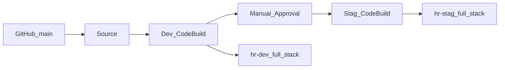

# DNS to DB + CloudWatch, deployed by CodePipeline (AWS + Terraform)

**Continuation of** [portfolio-DNS-to-DB-ASG-CloudWatch](../portfolio-DNS-to-DB-ASG-CloudWatch): the same full stack (Route 53 → ACM → ALB → App1/App2 + App3 ASG → private RDS + Parameter Store + Session Manager + CloudWatch alarms/canary), **applied by AWS CodePipeline** with the same four stages as [lesson 22](../22-IaC-DevOps-using-AWS-CodePipeline/README.md) — not the smaller section-15 demo (no bastion, no SSH keys, no App1-only ASG). The pipeline itself is Terraform in `pipeline/`, which the course left as console clicks.

The CloudWatch folder stays a local-state lab. This sibling is the pipeline project: **one set of app `.tf` files, two backends, two var-files**, plus a separate **`pipeline/`** Terraform root that creates CodePipeline/CodeBuild. Push the folder to a dedicated GitHub repo whose `main` branch is the pipeline Source.

Read the [CloudWatch README](../portfolio-DNS-to-DB-ASG-CloudWatch/README.md) for alarms, synthetics, and request-path diagrams. This README is the **pipeline**: stages, `pipeline/` apply, IAM, verify, destroy, cost.

| | |
|---|---|
| **Problem** | A full DNS-to-DB stack applied by hand cannot be promoted the same way twice (dev then staging) with a review gate |
| **Approach** | GitHub → CodePipeline → CodeBuild Terraform apply to **dev**, manual SNS approval, then the same manifests to **stag** (separate state, VPC, RDS, ASG, DNS, canary) |
| **Outcome** | Push to `main` deploys `hr-dev`; you click Approve; staging gets the same stack on its own hostname |

### Built with

| Area | Technologies |
|------|----------------|
| **Source** | GitHub (CodePipeline v2 connection / AWS Connector for GitHub) |
| **CI / apply** | AWS CodeBuild (`buildspec-dev.yml` / `buildspec-stag.yml`); Terraform **is** the deploy (no CodeDeploy) |
| **Gate** | CodePipeline Manual Approval + SNS email |
| **State** | S3 backend + DynamoDB lock (`dev.conf` / `stag.conf`), created by `pipeline/` |
| **Secrets** | Parameter Store `/CodeBuild/DB_PASSWORD` and `/CodeBuild/APP3_DB_PASSWORD` (never committed; no access keys) |
| **Stack** | Same `c1`–`c16` as the CloudWatch portfolio, per environment |
| **Pipeline as code** | Separate Terraform root `pipeline/` (not applied by CodeBuild) |

**Skills shown:** CodePipeline · CodeBuild · pipeline as code · GitHub connections · remote state · multi-env tfvars · IAM for CodeBuild · Terraform apply/destroy in CI

There is **no Deploy action**. Terraform runs inside CodeBuild — same as the course.



---

## Pipeline stages

One pipeline, four stages (same shape as lesson 22):

| Stage | Provider | What it does |
|---|---|---|
| **Source** | GitHub (v2 connection) | On push to `main`, zip the repo as `SourceArtifact` |
| **Dev-Deploy** | CodeBuild + `buildspec-dev.yml` | `terraform init` with `dev.conf` → validate → plan → apply `dev.tfvars` + secrets → wait for App3 SSM → run `ops/phase-a-create-app3-user.sh` |
| **Email-Approval** | Manual approval + SNS | You click Approve before staging is touched |
| **Stage-Deploy** | CodeBuild + `buildspec-stag.yml` | Same commands against `stag.conf` / `stag.tfvars` (separate state, separate VPC/RDS/ASG/DNS/canary) |

**Destroy** is the course trick: flip `TF_COMMAND` from `apply` to `destroy` in **both** buildspecs, commit, and approve through the pipeline.

The pipeline is created by **`pipeline/` Terraform** from your laptop (once). CodeBuild never applies that root — it only applies `terraform-manifests/` (VPC/RDS/App3). GitHub OAuth for the connection still needs one console click.

### What CodeBuild runs (per environment)

1. Install Terraform **1.15.8** (Terraform ≥ 1.6; not the course’s `0.15.3`)
2. Write gitignored `secrets.tfvars` from Parameter Store (`ops/write-secrets-tfvars.sh`)
3. `cd terraform-manifests`
4. `terraform init -input=false -backend-config=<env>.conf`
5. `terraform validate`
6. `terraform plan -var-file=<env>.tfvars -var-file=secrets.tfvars`
7. `terraform $TF_COMMAND -var-file=<env>.tfvars -var-file=secrets.tfvars -auto-approve`
8. **If apply (not destroy):** `./ops/phase-a-create-app3-user.sh` so MySQL user `app3` exists and the ASG refreshes (this is why App3 is unhealthy right after a first apply)

Each CodeBuild project timeout is **90 minutes** (`pipeline/`). This stack waits on ACM DNS validation, Multi-AZ RDS, ASG, and the bootstrap. Terraform authenticates as the **CodeBuild service role** (no `profile`, no long-lived access keys).

### What each environment still gets

Same as the CloudWatch portfolio:

- VPC + NAT, path ALB (`/app1*`, `/app2*`, `/*`), HTTPS + ACM
- App1/App2 fixed private EC2, App3 ASG (target tracking only)
- Private RDS MySQL, Parameter Store `/<env>/app3/db/*`, Session Manager (no SSH)
- SNS + CloudWatch: ASG CPU, ALB 4xx/5xx, Synthetics SuccessPercent

Names that would collide in one account are prefixed with `local.name` (security groups, RDS identifier). Canaries are `dev-dnstodb` and `stag-dnstodb`. DNS is `var.dns_name` per env (hosted zone stays `biademos.com` unless you change it).

---

## Repo layout

What CodePipeline clones (push this folder to a **dedicated GitHub repo**):

```text
portfolio-DNS-to-DB-ASG-CloudWatch-CodePipeline/
├── README.md
├── PLAN.md
├── buildspec-dev.yml
├── buildspec-stag.yml
├── pipeline/                      # CodePipeline + CodeBuild + IAM (laptop apply)
└── terraform-manifests/
    ├── c1-… c16-…                 # full CloudWatch stack (CodeBuild apply)
    ├── canary/  ops/
    ├── terraform.tfvars           # region + business_divsion only
    ├── dev.tfvars / stag.tfvars
    ├── dev.conf / stag.conf
    └── secrets.tfvars.example     # real secrets never committed
```

`terraform.tfvars` must stay generic. `environment` lives only in `dev.tfvars` / `stag.tfvars` so both pipeline stages do not share the same name prefix.

---

## Prerequisites

- AWS account with permission to create CodePipeline, CodeBuild, IAM, S3, DynamoDB, and the app stack
- GitHub account; AWS Connector for GitHub (install if needed: [github.com/settings/installations](https://github.com/settings/installations))
- Route 53 public hosted zone (this repo uses `biademos.com` — change it if that is not yours)
- Two strong, **different** passwords (RDS master + App3 user)

### Customize before the first pipeline run

| What | Where |
|------|--------|
| Hosted zone | `c6-02-datasource-route53-zone.tf` (`name = "biademos.com"`) |
| ACM SAN | `c11-acm-certificatemanager.tf` (`"*.biademos.com"`) |
| Per-env hostname | `dev.tfvars` → `dns-to-db-dev.biademos.com`; `stag.tfvars` → `dns-to-db.biademos.com` |
| SNS alarm/lifecycle email | `asg_notification_email` in **both** `dev.tfvars` and `stag.tfvars` |
| Region / division | `terraform.tfvars` (`aws_region`, `business_divsion`) |
| State bucket / lock tables | `dev.conf` / `stag.conf` (created by `pipeline/` unless you set `manage_app_remote_state = false`) |

Do **not** commit `secrets.tfvars`. CodeBuild writes it at build time from Parameter Store.

---

## One-time setup

Two Terraform roots, on purpose:

| Root | Applied from | Creates |
|------|----------------|---------|
| **`pipeline/`** | Your laptop, once | CodePipeline, CodeBuild, IAM, approval SNS, artifact bucket, app **remote state** bucket + lock tables |
| **`terraform-manifests/`** | CodeBuild on every run | VPC, ALB, App3, RDS, CloudWatch (dev then stag) |

`pipeline/` uses **local state** so it can create the S3 backend the app stack needs. Do not point CodeBuild at `pipeline/` or a push would try to manage the pipeline that is running it.

If you already created the pipeline or state bucket in the console, import those resources or delete the console copies before apply (same names will conflict).

### 1. GitHub repository

1. Create a **new** GitHub repo (private is fine). Example name: `portfolio-dnstodb-cw-codepipeline`.
2. Copy the contents of this folder (buildspecs at repo **root**, plus `terraform-manifests/` and `pipeline/`).
3. Push to `main`.

```bash
git add .
git commit -m "Initial CodePipeline Terraform stack"
git push -u origin main
```

Confirm `buildspec-dev.yml` and `buildspec-stag.yml` sit at the repository root — that is what CodeBuild looks for.

### 2. DB passwords in Parameter Store

Not created by Terraform (values would land in state).

**Systems Manager → Parameter Store → Create parameter** (SecureString, Standard):

| Name | Maps to |
|------|---------|
| `/CodeBuild/DB_PASSWORD` | RDS master (`db_password`) |
| `/CodeBuild/APP3_DB_PASSWORD` | MySQL user `app3` (`app3_db_password`) |

```bash
aws ssm put-parameter --name /CodeBuild/DB_PASSWORD --type SecureString \
  --value 'YOUR_RDS_MASTER_PASSWORD'
aws ssm put-parameter --name /CodeBuild/APP3_DB_PASSWORD --type SecureString \
  --value 'YOUR_APP3_USER_PASSWORD'
```

Do **not** store AWS access keys. Terraform uses the CodeBuild role.

### 3. Apply `pipeline/` (laptop)

```bash
cd pipeline
cp terraform.tfvars.example terraform.tfvars   # gitignored
# Set github_full_repository_id (owner/name) and approval_email
terraform init
terraform apply
```

What this creates (names match the rest of this README):

| Resource | Default name |
|----------|----------------|
| Pipeline | `tf-dnstodb-cw-cp1` (Source → Dev-Deploy → Email-Approval → Stage-Deploy, **no** CodeDeploy). Execution mode **QUEUED** so a second push does not cancel an in-flight apply. |
| CodeBuild | `codebuild-dnstodb-dev`, `codebuild-dnstodb-stag` (AL2 standard 5.0, **90** minute timeout, `buildspec-*.yml`) |
| GitHub connection | `terraform-dnstodb-cw-con1` (or set `codestar_connection_arn` to reuse one) |
| Approval SNS | `{pipeline_name}-approval` + email subscription |
| Artifact bucket | `{account-id}-dnstodb-cw-cp-artifacts` |
| App state | bucket `dnstodb-cw-codepipeline-tfstate` (versioned) + DynamoDB `dnstodb-cw-dev-tfstate` / `dnstodb-cw-stag-tfstate` (`LockID`) |

**Still in the console (cannot be fully automated):**

1. **GitHub handshake** — connection status starts as `PENDING`. Open the URL from `terraform output`. **Connect to GitHub** → install **AWS Connector for GitHub** if needed → grant **only** this repository → status **Available**.
2. **Confirm the SNS email** for pipeline approval (App3 alarm topics are created later by the app stack).
3. If the first pipeline run started before the connection was Available: **CodePipeline → Release change**.

Optional: if the state bucket name is taken, change `app_state_bucket_name` **and** both `dev.conf` / `stag.conf`.

---

## IAM (both CodeBuild roles)

`pipeline/` attaches this. You should not click extra policies in the console unless you set `codebuild_attach_administrator_access = false`.

### 1. Parameter Store (required for `env.parameter-store`)

Without this, DOWNLOAD_SOURCE fails before Terraform runs. Terraform creates an inline policy on both CodeBuild roles for `ssm:GetParameter` / `ssm:GetParameters` on `/CodeBuild/DB_PASSWORD` and `/CodeBuild/APP3_DB_PASSWORD`.

If you use a KMS CMK on those parameters, add `kms:Decrypt` on that key.

### 2. Terraform apply/destroy (the stack)

The CodeBuild role is what Terraform assumes. For a personal lab, `pipeline/` attaches **AdministratorAccess** to both roles (`codebuild_attach_administrator_access = true`). That is the straightforward equivalent of the course’s access-key admin user, without long-lived keys.

That covers VPC, EC2, RDS, ALB, ASG, ACM, Route 53, SNS, CloudWatch, IAM, S3 state, and DynamoDB locks.

### 3. App3 bootstrap (`phase-a-create-app3-user.sh`)

After apply, the build calls SSM SendCommand and starts an ASG instance refresh. AdministratorAccess already includes those actions. If you turn admin off, `pipeline/` attaches a small bootstrap policy (SendCommand, instance refresh) — you still need a broader apply policy or the plan will fail.

---

## First run and verify

1. Confirm the **pipeline approval** SNS email and that the GitHub connection is **Available** (and later each env’s App3 SNS subscription — the app Terraform creates those on apply).
2. Wait for **Dev-Deploy** (often 30–60+ minutes). Then **Approve**. Then wait for **Stage-Deploy**.
3. After each apply, the build bootstraps MySQL user `app3` and refreshes the ASG. App3 / the canary may fail until that refresh finishes and targets are healthy.

### URLs

| Env | App3 (`/`) | App1 | App2 |
|-----|------------|------|------|
| **dev** | `https://dns-to-db-dev.biademos.com/` | `…/app1/` | `…/app2/` |
| **stag** | `https://dns-to-db.biademos.com/` | `…/app1/` | `…/app2/` |

HTTP on port 80 redirects to HTTPS. Replace the domain if you changed `dns_name` / the hosted zone.

### Alarms and canaries

| Env | Canary name | Alarms |
|-----|-------------|--------|
| **dev** | `dev-dnstodb` | ASG CPU, ALB Target 4xx, ALB ELB 5xx, Synthetics SuccessPercent → that env’s App3 SNS |
| **stag** | `stag-dnstodb` | Same set, separate resources |

Console: **CloudWatch → Alarms**; **Synthetics → Canaries**.

```bash
# After a successful apply, from a machine with AWS CLI (optional)
aws synthetics get-canary --name dev-dnstodb
aws synthetics get-canary --name stag-dnstodb

aws cloudwatch describe-alarms \
  --query "MetricAlarms[?contains(AlarmName, 'ASG-CWA') || contains(AlarmName, 'ALB-HTTP') || contains(AlarmName, 'Synthetics')].[AlarmName,StateValue]" \
  --output table

aws ssm get-parameters-by-path --path /dev/app3/db --with-decryption
aws ssm get-parameters-by-path --path /stag/app3/db --with-decryption
```

ASG CPU alarms are **notify only** (no step scaling). Scaling stays target tracking (`c15-05`).

---

## Destroy via the pipeline

Do **not** rely on a local `terraform destroy` unless you have the same S3 state and var-files. The course pattern is:

1. In **both** `buildspec-dev.yml` and `buildspec-stag.yml`:

```yaml
    # TF_COMMAND: "apply"
    TF_COMMAND: "destroy"
```

2. Commit and push to `main`.
3. Let **Dev-Deploy** destroy `hr-dev`. Approve **Email-Approval**. Let **Stage-Deploy** destroy `hr-stag`.

On destroy, CodeBuild **skips** `phase-a-create-app3-user.sh`.

When you want to recreate, flip `TF_COMMAND` back to `apply` in both files, commit, and run the pipeline again.

The Route 53 hosted zone is not created by this stack. Leave it unless you no longer need AWS DNS for that domain. Parameter Store passwords are **not** in either Terraform root — delete those in the console when you are done.

Then destroy the plumbing (after both env stacks are gone):

```bash
cd pipeline
# If the state bucket still has objects, either empty it or:
#   terraform apply -var='app_state_bucket_force_destroy=true'
terraform destroy
```

Do **not** `terraform destroy` `pipeline/` while `hr-dev` / `hr-stag` still exist — that can delete the S3 backend those stacks use.

**Do not commit:** `secrets.tfvars`, `pipeline/terraform.tfvars`, `*.pem`, `*.tfstate`, `.terraform/`, generated `canary/*.zip`.

---

## Cost

Two full copies means **two** NAT gateways, **two** Multi-AZ RDS instances, **two** ASGs, **two** 1-minute canaries, plus two ALBs and the usual EC2.

| Resource | Notes |
|----------|--------|
| NAT + ALB + EC2 + RDS **× 2** | Main cost while both envs are up |
| RDS in this repo | `db.t3.large`, Multi-AZ (higher cost) |
| Synthetics | `rate(1 minute)` per env — meaningful demo cost |
| CodeBuild | Billed per build minute; 60–90 minute timeouts, first apply is long |
| S3 state + DynamoDB locks + CloudWatch alarms | Small |
| Pipeline / connections | Negligible |

Destroy via the pipeline when idle. Optional later: shrink RDS or the canary schedule in `dev.tfvars` only — not required for a course-faithful dual apply.

---

## Verify before you show it

- [ ] Dedicated GitHub repo on `main`; `buildspec-dev.yml` and `buildspec-stag.yml` at repo root
- [ ] `pipeline/` applied; GitHub connection **Available**; approval SNS email confirmed
- [ ] Parameter Store passwords created (**not** access keys)
- [ ] Pipeline `tf-dnstodb-cw-cp1`: Source → Dev-Deploy → Email-Approval → Stage-Deploy; **no** CodeDeploy stage
- [ ] Both CodeBuild projects: Amazon Linux 2, Python 3.9, timeout 90 minutes; IAM includes GetParameters + AdministratorAccess (lab)
- [ ] SNS emails confirmed (approval topic + each env’s App3 topic)
- [ ] `https://dns-to-db-dev.biademos.com/` (and `/app1/`, `/app2/`) after Dev-Deploy + ASG refresh
- [ ] After Approve: `https://dns-to-db.biademos.com/` paths work
- [ ] Canaries `dev-dnstodb` / `stag-dnstodb` succeed; CPU / ALB / SuccessPercent alarms exist per env
- [ ] App3 uses `/<env>/app3/db/*`, not `dbadmin`; no bastion or SSH keys
- [ ] Destroy: `TF_COMMAND: "destroy"` in both buildspecs, push, approve through; then `terraform destroy` in `pipeline/`

---

## What this does not copy from lesson 22

- Bastion, EIP, SSH `terraform-key.pem`, `c9` local-exec provisioners
- Access keys in Parameter Store as the way Terraform authenticates (this project uses the CodeBuild role)
- Terraform 0.15.3 / Python 3.7 runtime pins
- Console-clicked pipeline (this repo defines CodePipeline in `pipeline/`; GitHub OAuth handshake is still console)
